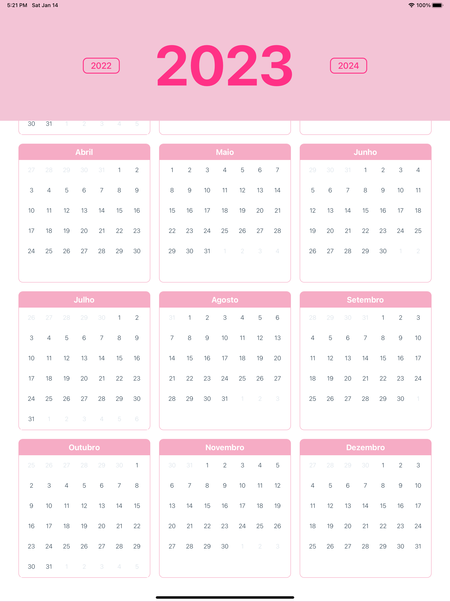

# Planner App

## Abstract 🧭
- [Planner App](#planner-app)
  - [Abstract 🧭](#abstract-)
  - [Getting Started 🏁](#getting-started-)
    - [Pre-requisits ✋🏼](#pre-requisits-)
    - [Installing ⚙️](#installing-️)
  - [Screenshot 📸](#screenshot-)
  - [Disclaimer  📝](#disclaimer--)


## Getting Started 🏁

### Pre-requisits ✋🏼
To run this project in the development mode, you'll need to have a basic environment with NodeJS and a simulator (Apple or Android).

### Installing ⚙️

Clone the repository and go to the folder:

```bash
$ git clone https://github.com/gabrielccarvalho/planner && cd planner
```

Install the dependencies with your package manager of choice:

with yarn

```bash
$ yarn install
```

with npm

```bash
$ npm install
```

Run the development enviroment and simulator:

with yarn

```bash
$ yarn start && yarn ios
```

or 

```bash
$ yarn start && yarn android
```

with npm

```bash
$ npm start && npm ios
```

or

```bash
$ npm start && npm android
```

## Screenshot 📸
<br/>

## Disclaimer  📝
The planner app is still in building stage. Although is ready to use, it might present a few bugs or slows.
